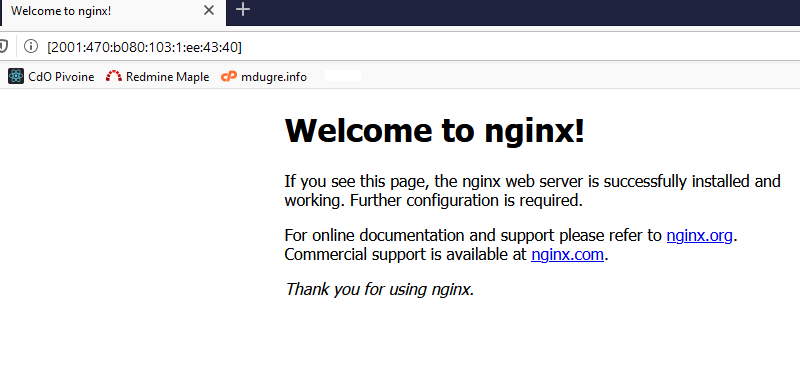

# Docker avec IPv6

[English version](README_en.md)

## Pourquoi?

- La liste d'addresses IPv4 non attribuées est épuisée : https://en.wikipedia.org/wiki/IPv4_address_exhaustion.
  On est en mode de recyclage et de [recouvrement](https://www.iana.org/assignments/ipv4-recovered-address-space/ipv4-recovered-address-space.xhtml)!
- Internet of Things (IoT), j'en veux!
- NAT (Network Address Translation) goûte mauvais. Je m'étais fait dire que c'était
  bon pour ma sécurité, mais j'y crois autant qu'aux produits naturels.


# Recette

## Configurer ip forwarding

  Cette étape est nécessaire pour créer des sous-réseaux (par exemple avec Docker).

  **Instructions**
  1. Ouvrir une session sur l'ordinateur qui recevra le nouveau réseau.
  2. `sudo cp /etc/sysctl.conf /etc/sysctl.conf.old`
  3. Configurer le fichier /etc/sysctl.conf:
     - `sudo nano /etc/sysctl.conf`
     - Ajouter :
        ```
        net.ipv6.conf.all.forwarding=1
        ```
  4. `sudo sysctl -p`

  _Résultat affiché_

  ```
  [...]
  net.ipv6.conf.all.forwarding = 1
  [...]
  ```

## Créer un réseau IPv6 sur Docker

Note: cette recette utilise le réseau créé dans la recette [Sous-réseaux avec
IPv6 statique par TunnelBroker](../../linux/ipv6_sousreseaux/README.md).

1. `docker network create --ipv6 --subnet 2001:470:b080:103:1::/80 he_ipv6`

**Exécuter :** `docker network inspect he_ipv6`

```
[
    {
        "Name": "he_ipv6",
        "Id": "24113567e27783941ab89f9968568b4e80b32e297928cada0c5a9bc5800ee34b",
        "Created": "2019-11-11T23:12:02.427572273Z",
        "Scope": "local",
        "Driver": "bridge",
        "EnableIPv6": true,
        "IPAM": {
            "Driver": "default",
            "Options": {},
            "Config": [
                {
                    "Subnet": "172.18.0.0/16",
                    "Gateway": "172.18.0.1"
                },
                {
                    "Subnet": "2001:470:b080:103:1::/80"
                }
            ]
        },
        "Internal": false,
        "Attachable": false,
        "Ingress": false,
        "ConfigFrom": {
            "Network": ""
        },
        "ConfigOnly": false,
        "Containers": {},
        "Options": {},
        "Labels": {}
    }
]
```

## Installer le script DockerIPV6Mapper.py

1. `sudo apt install python3-pip`
2. Copier le fichier [requirements.txt](requirements.txt) dans un répertoire de travail
3. `sudo pip3 install -r requirements.txt`
4. Copier le fichier [DockerIPV6Mapper.py](DockerIPV6Mapper.py) sous /usr/local/bin
5. `sudo chmod 755 /usr/local/bin/DockerIPV6Mapper.py`

**Exécuter :** `/usr/local/bin/DockerIPV6Mapper.py --debug`

Ouvrir une nouvelle session et **Exécuter :** `docker run --rm -it --label ipv6.mapper.network=he_ipv6 ubuntu bash`

_Résultat sur la fenêtre originale_

```
DEBUG:__main__.DockerIPV6Mapper:Elem: 2001:470:b080:103:1::/80
DEBUG:__main__.DockerIPV6Mapper:IPV6 Network : 2001:470:b080:103:1 / 80
INFO:__main__.DockerIPV6Mapper:Attache container 09f5bfffe9c274dedb933f7e43e224e4f085b5d38555f782d76c8b18f7b0af61 a l'adresse 2001:470:b080:103:1:4f:4d:a2
```

Ouvrir une troisième session et **Exécuter :** `docker network inspect he_ipv6`

_Résultat :_
```
[
    {
        "Name": "he_ipv6",
        "Id": "24113567e27783941ab89f9968568b4e80b32e297928cada0c5a9bc5800ee34b",
        "Created": "2019-11-11T23:12:02.427572273Z",
        "Scope": "local",
        "Driver": "bridge",
        "EnableIPv6": true,
        "IPAM": {
            "Driver": "default",
            "Options": {},
            "Config": [
                {
                    "Subnet": "172.18.0.0/16",
                    "Gateway": "172.18.0.1"
                },
                {
                    "Subnet": "2001:470:b080:103:1::/80"
                }
            ]
        },
        "Internal": false,
        "Attachable": false,
        "Ingress": false,
        "ConfigFrom": {
            "Network": ""
        },
        "ConfigOnly": false,
        "Containers": {
            "9a69dc07f4fcae862a4194d2551f99f4230d4fe113bdca2d98bb33b715a23e5c": {
                "Name": "determined_jackson",
                "EndpointID": "a6f40943ee6ca6846675569aace0dac6dc7bc004899286a2e087196c8ffe0a36",
                "MacAddress": "02:42:ac:12:00:02",
                "IPv4Address": "172.18.0.2/16",
                "IPv6Address": "2001:470:b080:103:1:3f:2:9b/80"
            }
        },
        "Options": {},
        "Labels": {}
    }
]
```

## Configuration du pare feu

Une règle _FORWARD_ doit être ajoutée au pare feu pour laisser entrer les requêtes
vers le serveur. Voici un exemple pour le port TCP 80 (http). La destination
est l'adresse IPv6 utilisée par le container.

1. `sudo ip6tables -A FORWARD -p tcp --dport 80 --destination 2001:470:b080:103:1:ee:43:40/128 -j ACCEPT`

## Utilisation avec docker

L'utilitaire reste en mémoire et se connecte à docker pour agir sur les événements
Container Attach. Lorsque le libellé (_label_) ipv6.mapper.network est détecté
sur le container, et si le réseau correspondant existe dans Docker, une nouvelle
adresse IPv6 est mappée pour ce container sur le réseau.

## Exemples complémentaires

- `docker run --rm -it --name mon_container --label ipv6.mapper.network=he_ipv6 ubuntu bash`
  - Cet exemple va toujours donner un suffixe 3d:7a:30; le suffixe est généré
    à partir de la fonction de hachage MD5 sur le littéral "mon_container".
- `docker run --rm -it --label ipv6.mapper.network=he_ipv6 --label ipv6.mapper.suffix=ab:cd:56 ubuntu bash`
  - Cet exemple va toujours donner un suffixe ab\:cd:56 puisqu'il est fourni en paramètre.
    Le préfixe est chargé automatiquement à partir du réseau docker choisi.

## Paramètres de l'utilitaire DockerIPV6Mapper.py

- `--debug` : Logging niveau DEBUG
- `--info` : Logging niveau INFO
- `-d start` : Démarre en arrière plan (background)

## Installer comme service systemd

1. Copier [DockerIPV6Mapper.service](DockerIPV6Mapper.service) vers /etc/systemd/system
2. `sudo systemctl enable DockerIPV6Mapper`
3. `sudo systemctl start DockerIPV6Mapper`

## Le goûteur

1. `docker build -t nginx_ipv6 .`
2. `docker run -d --rm --name nginx --label ipv6.mapper.network=he_ipv6 nginx_ipv6`
3. Ouvrir un navigateur vers: http://[2001:470:b080:103:1:ee:43:40]

_Résultat dans le navigateur :_



# Références

- **Référence délicieuse :** https://docker-py.readthedocs.io/en/stable/
- https://github.com/diefans/docker-events/tree/master/src/docker_events
- https://docs.docker.com/engine/api/v1.30/#operation/SystemEvents
