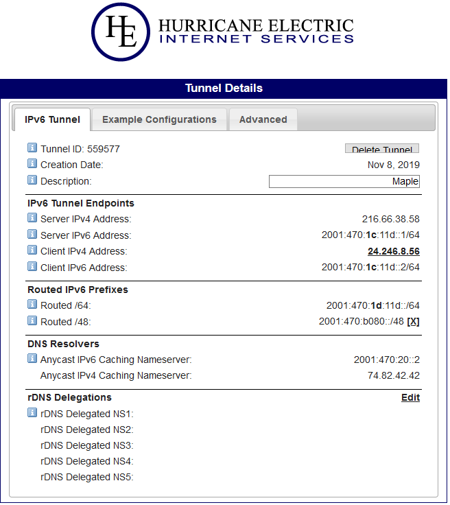

# Sous-réseaux avec IPv6 statique par TunnelBroker

[English version](README_en.md)

## Pourquoi?

- J'ai plusieurs systèmes virtuels (qemu) et j'utilise aussi docker. Je veux
  pouvoir accéder à ces ressources sans NAT ni _ndp proxy_.
- Le fournisseur internet avec lequel je fais affaire (TekSavvy via Rogers) ne
  donne pas accès à des adresses IPv6 **statiques** ni à des sous-réseaux (subnets)
  avec Prefix Delegation (PD) de /48 ou /56 bits.
- Changer le préfixe IPv6 sur tous mes _docker bridges_ devient agaçant très rapidement.
- Quand j'utilise uniquement la table d'adresses Hurricane Electric, Netflix
  me dit que j'ai un proxy et ne fonctionne pas.

## Nomenclature

- Une connexion internet qui alloue déjà une adresses IPv6 avec Prefix Delegation /64.
- Un routeur configuré avec ce projet: [Un RaspberryPi comme passerelle réseau](../rpi_passerelle/README.md)
- Un compte gratuit avec [Tunnelbroker](https://tunnelbroker.net/) de Hurricane Electric.
- Un ordinateur ou machine virtuelle avec Linux déjà fonctionnel avec IPv4 relié au
  réseau du routeur. J'utilise une machine virtuelle avec Ubuntu 18 Server.

## Avertissements

- Cette approche n'est probablement pas recommendable dans un environnement
  d'affaires, c'est plus approprié pour un individu qui désire explorer IPv6.
- Si votre adresse IPv4 change, il faut retourner sur le site de TunnelBroker
  pour modifier la _Client IPV4 Address_ de votre tunnel. Dans mon cas, mon
  adresse IPv4 dynamique change moins souvent que mon préfixe IPv6 dû à la
  configuration DHCP de Rogers.

## Préparation

Créer un tunnel /48 sur [Tunnelbroker](https://tunnelbroker.net/) - c'est gratuit.
Il suffit de s'enregistrer, créer un tunnel (/64) puis de cliquer sur le
bouton _Assign /48_. Sur l'image du bas, on voit que j'ai reçu _2001:470:b080_ sur la ligne _Routed /48_.
Ces adresses sont statiques - j'en ai une depuis plus d'un an et elle n'a jamais changée.



En ce moment, Tunnelbroker permet de créer 5 tunnels gratuits.

# Recette

## Créer le tunnel avec TunnelBroker

1. Copier le fichier [60-he-tunnel.conf](60-he-tunnel.conf) vers /lib/dhcpcd/dhcpcd-hooks
2. Ajuster les variables de la section _Parametres du tunnel_ dans le haut du script.
3. Noter que HE_ENDPOINT_PREFIX provient de l'adresse _IPV6 Tunnel Endpoints_, _Client IPV6 Address_
   de la page de TunnelBroker. Le tunnel est toujours ::1 pour le endpoint serveur et ::2 pour client.
   Dans mon cas, l'adresse est 2001:470:1c:11d::2, alors le prefixe /64 est 2001:470:1c:11d.
4. `sudo systemctl restart dhcpcd`

_Vérifier que le tunnel est actif_

**Exécuter :** `ping -t 1 2001:470:1c:11d::1`
Remplacer l'adresse par votre  _Server IPv6 address_.

_Résultat_

```
PING 2001:470:1c:11d::1(2001:470:1c:11d::1) from 2001:470:1c:11d::2 : 56 data bytes
64 bytes from 2001:470:1c:11d::1: icmp_seq=1 ttl=64 time=20.7 ms
64 bytes from 2001:470:1c:11d::1: icmp_seq=2 ttl=64 time=18.9 ms
```

## Configurer un nouveau sous-réseau sur un serveur

Pour cette recette, les sous-réseaux seront attribués avec un préfixe /64 et
routé directement via l'interface link-local du serveur qui agira comme
routeur pour le sous-réseau.

1. Ouvrir une session sur l'ordinateur qui recevra le nouveau réseau,
   idéalement via link-local (fe80...) ou ipv4.
2. `sudo cp /etc/netplan/50-cloud-init.yaml /etc/netplan/50-cloud-init.yaml.old`
3. Copier le fichier [50-cloud-init.yaml](50-cloud-init.yaml) dans /etc/netplan/
4. Remplacer eth0 par votre interface (voir votre fichier 50-cloud-init.yaml.old au besoin).
4. Ajuster le contenu pour votre sous réseau. Remplacer les 3 premiers blocs
   (préfixe) par le sous-réseau /48 alloué par TunnelBroker. Dans mon cas,
   c'est 2001:470:b80.
5. `sudo netplan try`

_Résultat_
```
Warning: Stopping systemd-networkd.service, but it can still be activated by:
  systemd-networkd.socket
Do you want to keep these settings?


Press ENTER before the timeout to accept the new configuration


Changes will revert in 120 seconds
```

Appuyer sur ENTER. Il est possible que vous soyez déconnecté (si connexion était
faite par IPv6). Reconnectez-vous au serveur.

**Exécuter :** `ip -6 a show dev eth0`  (Remplacer eth0 par votre interface)

_Résultat_:
```
2: eth0: <BROADCAST,MULTICAST,UP,LOWER_UP> mtu 1500 state UP qlen 1000
    inet6 2607:f2c0:eb70:1242:215:5dff:fe01:1f09/64 scope global dynamic mngtmpaddr noprefixroute
       valid_lft 604753sec preferred_lft 604753sec
    inet6 2001:470:b080:103::1/64 scope global
       valid_lft forever preferred_lft forever
    inet6 fe80::215:5dff:fe01:1f09/64 scope link
       valid_lft forever preferred_lft forever
```

_Note 1 :_ L'adresse 2607:f2c0:eb70:1242:215:5dff:fe01:1f09 est assignée automatiquement via
annonces du routeur (ça peut prendre 1 minute). C'est mon adresse globale qui existait déjà
avant l'ajout du nouveau sous-réseau.

_Note 2 :_ Prendre note de l'adresse _scope link_ (ici fe80::215:5dff:fe01:1f09). Elle sera
nécessaire pour configurer la route à l'étape suivante.

## Configurer le pare feu sur le sous-réseau

1. `sudo apt install iptables-persistent`
   - Répondre oui (Yes) aux questions.
2. `sudo cp /etc/iptables/rules.v6 /etc/iptables/rules.v6.old`
3. Copier le fichier [rules.v6](rules.v6) vers le répertoire /etc/iptables
4. Remplacer les 3 premiers blocs des adresses par votre préfixe /48.

**Attention**: Ici j'assume que vous n'avez aucun autre service que ssh (port 22)
à supporter sur cet hôte via IPv6. Ajouter d'autres ports dans la section INPUT,
au besoin.

## Configurer la route

Ouvrir (ou poursuivre) une session sur votre routeur.

1. `sudo nano /lib/dhcpcd/dhcpcd-hooks/60-he-tunnel.conf`
2. Ajouter votre route dans la fonction _configurer_routes_statiques()_
  - Utiliser votre réseau /48 (plutôt que l'exemple 2001:470:b080)
  - Utiliser votre adresse scope link fe80::... identifiée précédemment (plutôt que l'exemple fe80::215:5dff:fe01:1f09)
  - Coller la ligne : `ip -6 route add 2001:470:b080:103::/64 via fe80::215:5dff:fe01:1f09 dev $LAN`
3. `sudo systemctl daemon-reload`
4. `sudo systemctl restart dhcpcd`

**Exécuter :** `ip -6 route`

_Résultat :_

```
::1 dev lo proto kernel metric 256 pref medium
[...]
2001:470:b080:103::/64 via fe80::215:5dff:fe01:1f09 dev eth0 metric 1024 pref medium
[...]
default via fe80::217:10ff:fe91:185 dev eth1 proto ra metric 203 mtu 1500 pref medium
```

**Exécuter :** `ping 2001:470:b080:103::1`

_Résultat :_

```
PING 2001:470:b080:103::1(2001:470:b080:103::1) 56 data bytes
64 bytes from 2001:470:b080:103::1: icmp_seq=1 ttl=64 time=1.98 ms
64 bytes from 2001:470:b080:103::1: icmp_seq=2 ttl=64 time=1.05 ms
```

5. `sudo cp /etc/iptables/rules.v6 /etc/iptables/rules.v6.old-ipv6_sousreseaux`
6. `sudo ip6tables-restore /etc/iptables/rules.v6`
7. `sudo ip6tables -A FORWARD --destination 2001:470:b080:103::/64 -j ACCEPT`
8. `sudo ip6tables-save | sudo tee /etc/iptables/rules.v6`

Utiliser la session sur l'ordinateur avec le nouveau sous-réseau.

**Exécuter :** `ping -I 2001:470:b080:103::1 2001:470:1c:11d::1`

```
PING 2001:470:1c:11d::1(2001:470:1c:11d::1) from 2001:470:b080:103::1 : 56 data bytes
64 bytes from 2001:470:1c:11d::1: icmp_seq=1 ttl=63 time=16.9 ms
64 bytes from 2001:470:1c:11d::1: icmp_seq=2 ttl=63 time=18.7 ms
```

**Exécuter :** `ping -I 2001:470:b080:103::1 www.google.ca`

```
PING www.google.ca(yyz12s06-in-x03.1e100.net (2607:f8b0:400b:802::2003)) from 2001:470:b080:103::1 : 56 data bytes
64 bytes from yyz12s06-in-x03.1e100.net (2607:f8b0:400b:802::2003): icmp_seq=1 ttl=57 time=18.6 ms
64 bytes from yyz12s06-in-x03.1e100.net (2607:f8b0:400b:802::2003): icmp_seq=2 ttl=57 time=17.2 ms
```

# Références

- TunnelBroker de Hurricane Electric : https://tunnelbroker.net
- https://unix.stackexchange.com/questions/22770/two-interfaces-two-addresses-two-gateways
- http://www.szakmeister.net/blog/2017/jun/1/static-ip-nmcli/
